# 🚀 AI-Driven Code Generation SaaS Platform

### Lovable / v0.dev-style AI Application Builder

> A distributed AI SaaS platform that transforms natural-language prompts into complete React applications, manages project workspaces, and provisions live Kubernetes preview environments.

[](https://www.java.com/)
[](https://spring.io/projects/spring-boot)
[](https://spring.io/projects/spring-ai)
[](https://react.dev/)
[](https://kubernetes.io/)
[](https://www.docker.com/)

---

## 📌 Overview

**Distributed Lovable** is an AI-driven full-stack development platform inspired by products such as **Lovable** and **v0.dev**.

Users can describe an application using natural language:

> **"Build a snake game in React"**

The platform uses AI to generate the application source code, persists the project files, synchronizes them with object/shared storage, launches a Kubernetes preview environment, and exposes the generated application through a dynamic preview URL.

### Core workflow

```text
Natural Language Prompt
          │
          ▼
┌───────────────────────┐
│   AI Code Generation  │
│ Spring AI + OpenRouter│
└───────────┬───────────┘
            │
            ▼
┌───────────────────────┐
│ Structured File Changes│
└───────────┬───────────┘
            │
            ▼
┌───────────────────────┐
│   Project Workspace   │
└───────────┬───────────┘
            │
            ▼
┌────────────────────────────┐
│ PostgreSQL + MinIO + NFS   │
└────────────┬───────────────┘
             │
             ▼
┌────────────────────────────┐
│ Kubernetes Runner Pool     │
│ Node.js + Vite              │
└────────────┬───────────────┘
             │
             ▼
┌────────────────────────────┐
│ Dynamic Preview Proxy       │
└────────────┬───────────────┘
             │
             ▼
       Live React App
```

---

# 🏗️ System Architecture

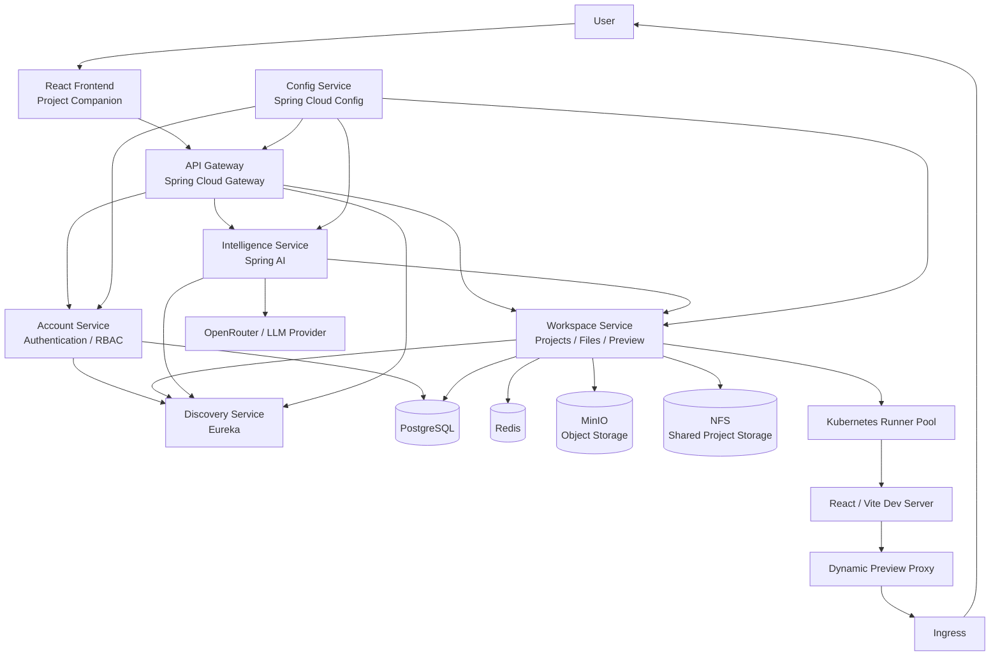

---

# 🤖 AI Code Generation

The intelligence service is responsible for transforming natural-language instructions into structured project changes.

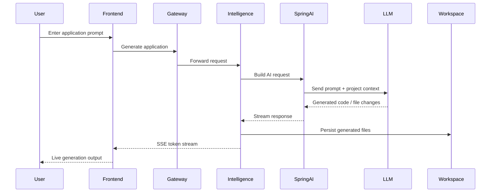

### Example

```text
Prompt:

"Build a snake game in React"

            ↓

AI reasoning / generation

            ↓

Structured file changes

            ↓

src/
├── App.tsx
├── main.tsx
├── components/
│   └── SnakeGame.tsx
├── styles/
│   └── game.css
└── ...

            ↓

Workspace persistence

            ↓

Kubernetes preview

            ↓

Live application
```

---

# ⚡ Real-Time Streaming with SSE

The platform uses **Server-Sent Events (SSE)** to stream AI generation results to the frontend.

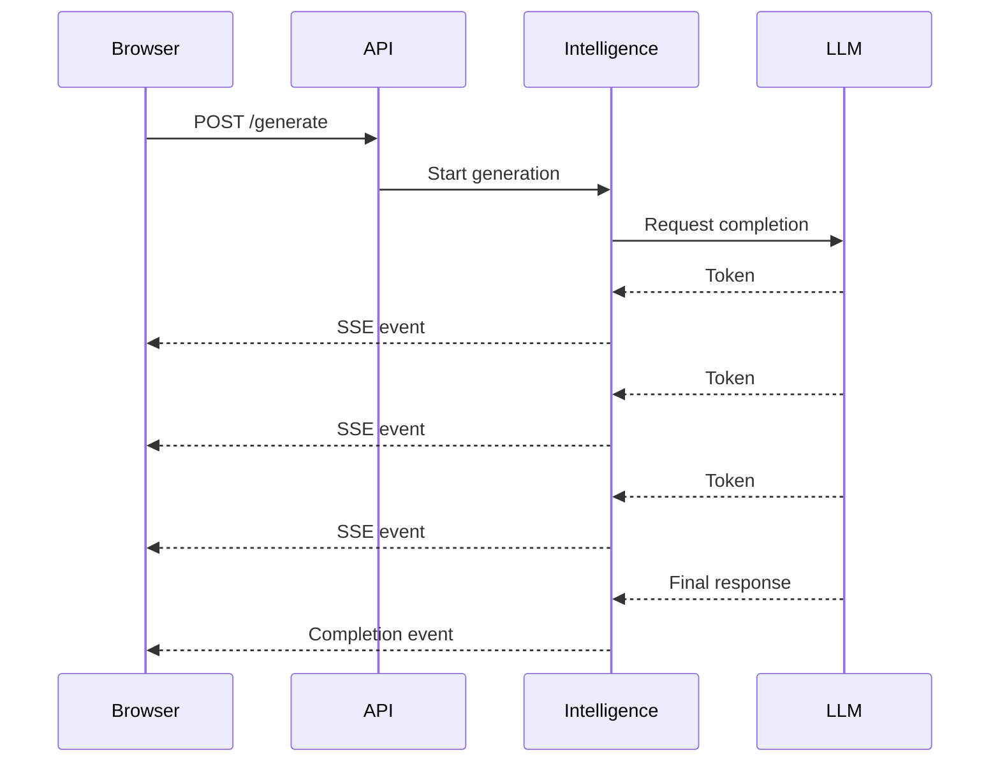

### Streaming characteristics

- Real-time AI token delivery
- SSE-based browser communication
- Long-running generation support
- Incremental UI updates
- Reduced perceived generation latency
- Designed for high concurrent session volume

---

# ☸️ Kubernetes Preview Architecture

Generated applications are executed inside Kubernetes-managed runner environments.

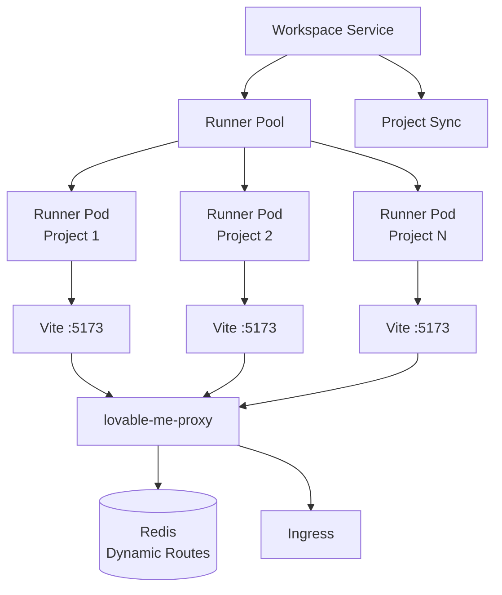

### Runner responsibilities

Each runner can:

- Receive project files
- Synchronize project state
- Install dependencies
- Start the Vite development server
- Serve generated React applications
- Provide a runtime for live previews

---

# 🌐 Dynamic Preview Routing

Preview environments use dynamically generated subdomains.

Example:

```text
project-2.previews.codingshuttle.in
```

The routing flow is:

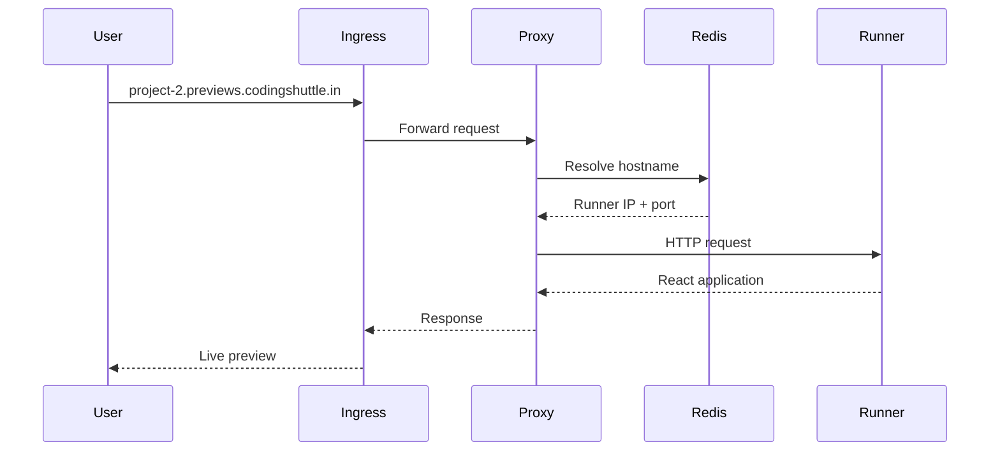

Redis stores the dynamic route:

```text
route:
project-2.previews.codingshuttle.in

target:
<runner-pod-ip>:5173
```

This allows preview traffic to be dynamically routed to the correct project runtime.

---

# 💾 Project Persistence

Project data is designed around persistent storage components.

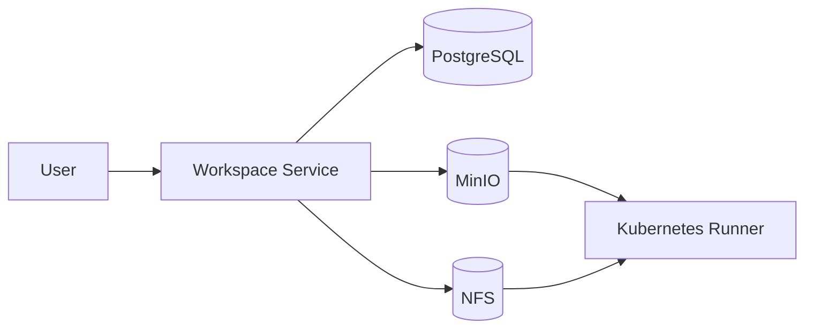

### Storage responsibilities

| Component | Responsibility |
|---|---|
| PostgreSQL | Application metadata, projects, users, persistence |
| MinIO | Object/project file storage |
| NFS | Shared filesystem/project persistence |
| Redis | Dynamic preview route resolution |

---

# 🧩 Microservice Architecture

The backend is divided into independent Spring Boot services.

| Service | Responsibility |
|---|---|
| **API Gateway** | External API entry point and routing |
| **Account Service** | Authentication, authorization, users and RBAC |
| **Workspace Service** | Projects, files, workspace management and previews |
| **Intelligence Service** | AI code generation and streaming |
| **Config Service** | Centralized configuration |
| **Discovery Service** | Service registration and discovery |
| **Common Library** | Shared security and backend utilities |

---

# 🔐 Authentication & RBAC

The platform supports authenticated multi-user workflows with role-based authorization.

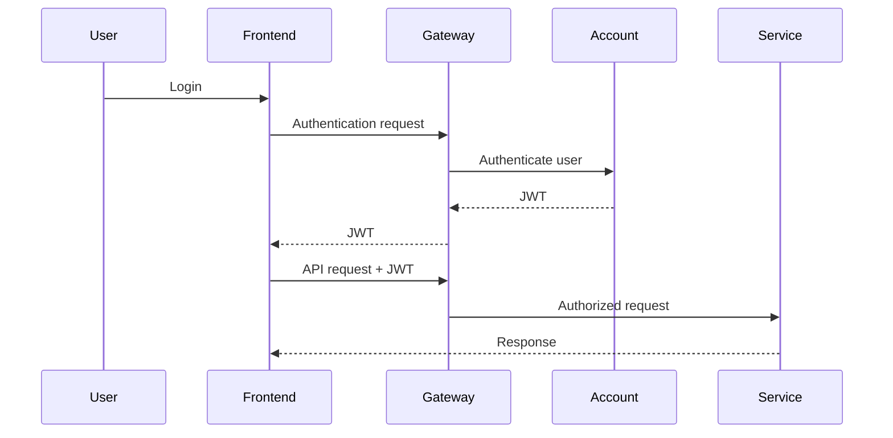

### Security capabilities

- JWT-based authentication
- Role-based access control
- Protected API endpoints
- User/project ownership
- Multi-tenant application design
- Service-level authorization

---

# 💳 SaaS Architecture

The platform is designed as a multi-tenant SaaS application.

```text
                    SaaS Platform
                         │
          ┌──────────────┼──────────────┐
          │              │              │
          ▼              ▼              ▼
       User A          User B         User C
          │              │              │
          ▼              ▼              ▼
      Projects        Projects       Projects
          │              │              │
          └──────────────┼──────────────┘
                         │
                         ▼
                  Shared Platform
                         │
       ┌─────────────────┼─────────────────┐
       │                 │                 │
       ▼                 ▼                 ▼
     AI LLM          Kubernetes         Storage
```

### SaaS capabilities

- Multi-user architecture
- Project isolation
- Authentication
- RBAC
- Token quota tracking
- Subscription-plan architecture
- Usage-aware AI generation
- Scalable backend services

---

# 📈 Performance & Scalability

The following performance figures are based on instructor-led load and performance testing of the platform.

| Metric | Result |
|---|---:|
| Concurrent streaming sessions | **10K+** |
| Token streaming latency | **< 200 ms** |
| Preview cold-start | **< 2 sec** |
| Stream reliability | **99.9%** |
| Code-generation capacity | **50K+ requests/day** |
| Throughput scaling | **Linear under tested load** |

The architecture is designed around horizontal scaling:

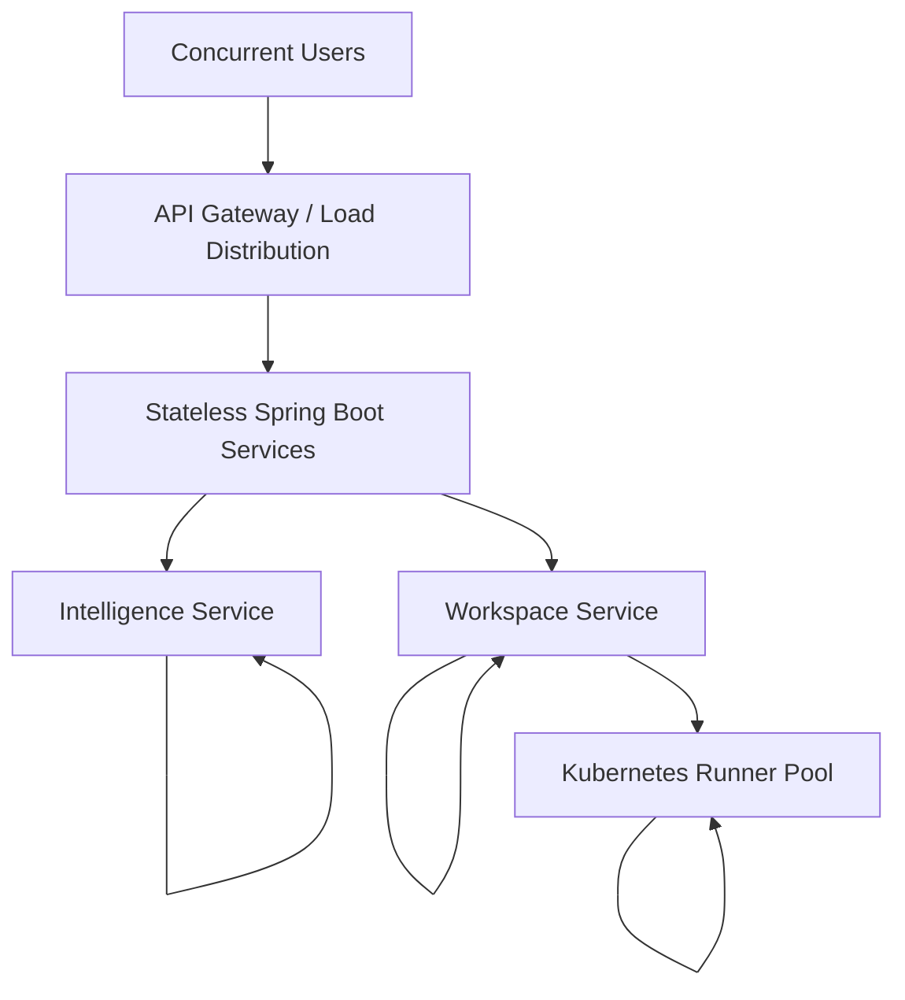

The primary scaling strategy is:

```text
More Users
    ↓
More Service Replicas
    ↓
More Runner Capacity
    ↓
More Concurrent Projects
```

---

# 📨 Kafka-Based Event Architecture

Kafka is part of the distributed infrastructure for asynchronous event-driven communication.

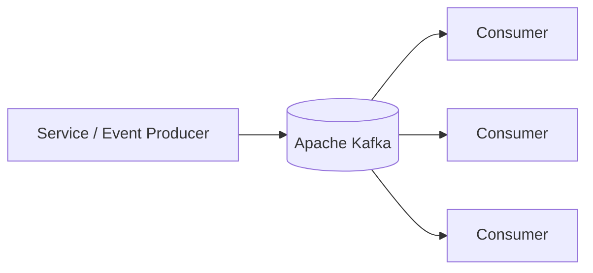

Kafka provides a foundation for:

- Asynchronous processing
- Event-driven workflows
- Service decoupling
- Background processing
- Scalable event consumption

---

# 🔎 Service Discovery

The platform uses Eureka-based service discovery.

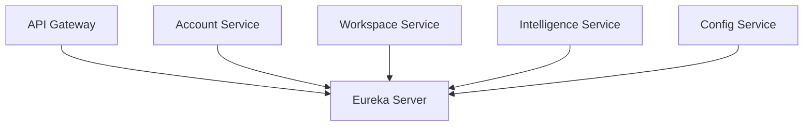

Services register themselves with Eureka and discover other backend services dynamically.

---

# ⚙️ Centralized Configuration

Configuration is centralized through Spring Cloud Config.

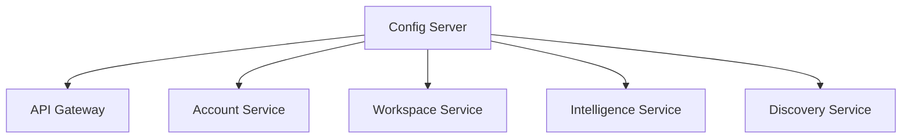

This keeps environment-specific configuration separate from service implementation.

---

# 🧰 Technology Stack

## Backend

- Java
- Spring Boot
- Spring Web
- Spring Security
- Spring Data JPA
- Spring Cloud Gateway
- Spring Cloud Config
- Spring Cloud Netflix Eureka
- Spring AI
- OpenFeign
- JWT

## AI

- Spring AI
- OpenRouter
- Large Language Models
- Structured code generation
- Streaming responses

## Frontend

- React
- TypeScript
- Vite
- Tailwind CSS
- React Router
- TanStack Query
- CodeMirror
- Monaco Editor
- React Markdown
- Radix UI

## Infrastructure

- Docker
- Kubernetes
- Kind
- Ingress NGINX
- Fabric8 Kubernetes Client
- Redis
- PostgreSQL
- MinIO
- NFS
- Apache Kafka
- Eureka

---

# 📁 Repository Structure

```text
distributed-lovable/
│
├── account-service/
│
├── api-gateway/
│
├── common-lib/
│
├── config-service/
│
├── discovery-service/
│
├── intelligence-service/
│
├── workspace-service/
│
├── project-companion/
│
├── docker/
│
├── k8s/
│   ├── infra/
│   ├── services/
│   ├── stateful/
│   └── proxy/
│
├── .github/
│
├── .gitignore
│
└── README.md
```

---

# 🔄 End-to-End Request Flow

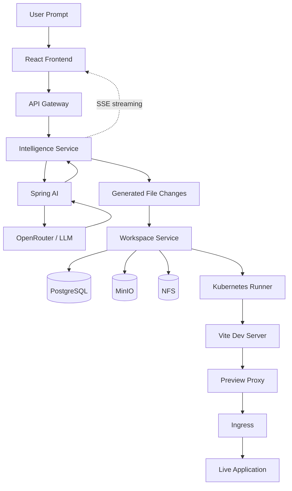

---

# 🚀 Local Development

## Prerequisites

Install:

- Java
- Maven
- Node.js
- npm
- Docker
- Kubernetes
- Kind
- kubectl

---

## Start Kubernetes

Create the Kind cluster and deploy the required infrastructure.

Example:

```bash
kind create cluster --name shuttle-ai
```

Verify:

```bash
kubectl get nodes
```

---

## Deploy Kubernetes Resources

```bash
kubectl apply -f k8s/namespaces.yaml
```

Then deploy the required infrastructure and services:

```bash
kubectl apply -f k8s/stateful/
kubectl apply -f k8s/services/
kubectl apply -f k8s/infra/
kubectl apply -f k8s/proxy/
```

Verify:

```bash
kubectl get pods -A
```

---

# 🌐 Local API Access

For local frontend development, expose the API Gateway:

```bash
kubectl port-forward svc/api-gateway 8080:80 -n lovable-core
```

The frontend can then communicate with:

```text
http://localhost:8080
```

---

# 🖥️ Frontend Development

```bash
cd project-companion
npm install
npm run dev
```

The frontend is built using React + TypeScript + Vite.

---

# 👀 Live Preview Development

The preview system uses Kubernetes runners and dynamic routing.

A runner starts the generated Vite application on:

```text
0.0.0.0:5173
```

The preview proxy then routes:

```text
project-id.previews.codingshuttle.in
```

to the corresponding runner.

For local Kind development, the ingress controller can be exposed through:

```bash
kubectl port-forward \
  -n ingress-nginx \
  svc/ingress-nginx-controller \
  8081:80 \
  --address 0.0.0.0
```

Then a local preview can be accessed using:

```text
http://project-2.previews.codingshuttle.in:8081
```

Add the preview hostname to the local hosts file when required:

```text
127.0.0.1 project-2.previews.codingshuttle.in
```

---

# ☸️ Kubernetes Components

The Kubernetes deployment contains several infrastructure layers.

```text
Kubernetes Cluster
│
├── lovable-core
│   ├── API Gateway
│   ├── Account Service
│   ├── Workspace Service
│   ├── Intelligence Service
│   ├── Config Service
│   └── Discovery Service
│
├── lovable-previews
│   └── Runner Pool
│
├── ingress-nginx
│   └── Ingress Controller
│
└── Stateful Infrastructure
    ├── PostgreSQL
    ├── Redis
    ├── MinIO
    └── Kafka
```

---

# 🔐 Security

Security is an important part of the platform design.

### Implemented / designed security controls

- JWT authentication
- Role-based authorization
- Protected service endpoints
- Project-level ownership
- Multi-tenant boundaries
- Kubernetes workload isolation
- Network policies
- Environment-based configuration
- Secret separation from source code

### Important

Secrets such as:

```text
API keys
JWT secrets
Database passwords
Cloud credentials
OAuth credentials
```

should **never be committed to Git**.

Use environment variables, Kubernetes Secrets, or an external secret-management system.

---

# 📊 Architecture Summary

```text
                         ┌─────────────────────┐
                         │       USERS         │
                         └──────────┬──────────┘
                                    │
                                    ▼
                         ┌─────────────────────┐
                         │   React Frontend   │
                         └──────────┬──────────┘
                                    │
                                    ▼
                         ┌─────────────────────┐
                         │    API Gateway      │
                         └──────────┬──────────┘
                                    │
              ┌─────────────────────┼─────────────────────┐
              │                     │                     │
              ▼                     ▼                     ▼
       ┌────────────┐       ┌──────────────┐      ┌──────────────┐
       │  Account   │       │  Workspace   │      │ Intelligence │
       │  Service   │       │   Service    │      │   Service    │
       └─────┬──────┘       └──────┬───────┘      └──────┬───────┘
             │                     │                     │
             ▼                     ▼                     ▼
        PostgreSQL           Storage / Redis       Spring AI
                                                        │
                                                        ▼
                                                   OpenRouter
                                                        │
                                                        ▼
                                                 Generated Code
                                                        │
                                                        ▼
                                               Kubernetes Runner
                                                        │
                                                        ▼
                                                     Vite
                                                        │
                                                        ▼
                                                 Preview Proxy
                                                        │
                                                        ▼
                                                     Ingress
                                                        │
                                                        ▼
                                                  Live Preview
```

---

# 📌 Current Project Status

### Implemented

- [x] Distributed Spring Boot backend
- [x] API Gateway
- [x] Account/authentication service
- [x] Workspace/project service
- [x] AI intelligence service
- [x] Spring AI integration
- [x] OpenRouter-based LLM integration
- [x] SSE-based AI streaming
- [x] React frontend
- [x] Project/file management
- [x] PostgreSQL persistence
- [x] Redis integration
- [x] MinIO object storage
- [x] NFS-based shared storage
- [x] Kubernetes runner architecture
- [x] Dynamic preview routing
- [x] Ingress-based traffic routing
- [x] Eureka service discovery
- [x] Spring Cloud Config
- [x] Kafka infrastructure
- [x] RBAC
- [x] Token quota architecture
- [x] Subscription-plan architecture
- [x] Multi-tenant SaaS architecture

---

# 🔮 Future Improvements

Potential future improvements include:

- [ ] Production cloud deployment
- [ ] Managed Kubernetes deployment
- [ ] Automated CI/CD pipelines
- [ ] Advanced observability
- [ ] Distributed tracing
- [ ] Prometheus metrics
- [ ] Grafana dashboards
- [ ] Centralized log aggregation
- [ ] Automatic runner autoscaling
- [ ] GPU-backed model inference
- [ ] Model selection per subscription tier
- [ ] Advanced usage analytics
- [ ] Payment provider integration
- [ ] Custom domains for generated applications
- [ ] Production-grade secret management
- [ ] Automated preview cleanup
- [ ] Multi-region deployment

---

# 🧠 Engineering Highlights

### Distributed Backend

Designed the platform as multiple independently deployable Spring Boot services instead of a monolithic backend.

### AI-Native Application Generation

Integrated Spring AI with an external LLM provider to transform natural-language requirements into structured application code.

### Real-Time Streaming

Implemented SSE-based streaming so generated AI output can be delivered incrementally to the browser.

### Kubernetes Runtime Provisioning

Designed a runner-pool architecture where generated applications can be executed inside Kubernetes-managed environments.

### Dynamic Preview Infrastructure

Implemented hostname-based routing so each generated application can receive its own live preview URL.

### Persistent Project Storage

Combined PostgreSQL metadata with MinIO object storage and shared filesystem infrastructure for project persistence.

### SaaS-Oriented Design

Added authentication, RBAC, token quotas, subscription architecture and multi-tenant project boundaries.

### Horizontal Scalability

Designed stateless backend services and scalable Kubernetes runners to support increasing concurrent workloads.

---

# 📈 Performance Summary

Based on instructor-led testing:

```text
10K+ concurrent streaming sessions
          │
          ▼
< 200 ms token streaming latency
          │
          ▼
< 2 sec preview cold start
          │
          ▼
99.9% stream reliability
          │
          ▼
50K+ code-generation requests/day
          │
          ▼
Linear throughput scaling
```

These figures represent the tested architecture and workload conditions rather than a universal production guarantee.

---

# 🎯 Why This Project Matters

This project combines several areas of modern software engineering into a single distributed platform:

```text
        AI / LLM
           │
           ▼
    Code Generation
           │
           ▼
   Distributed Systems
           │
           ▼
    Microservices
           │
           ▼
     Kubernetes
           │
           ▼
   Dynamic Runtimes
           │
           ▼
      SaaS Model
```

The result is an end-to-end system capable of taking a natural-language application request and turning it into a running, previewable web application.

---

# 👨‍💻 Author

**Muzzu321**

GitHub:

https://github.com/Muzzu321

---

# ⭐ Project

If you find the architecture interesting, feel free to explore the repository and the individual services.

**Built with Java, Spring Boot, Spring AI, React, Kubernetes, Docker, PostgreSQL, Redis, MinIO, Kafka and modern cloud-native architecture.**
